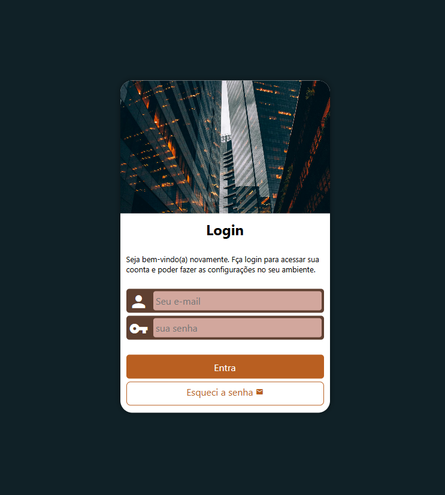

<h1 align="center"> Projeto Login </h1>

   

   O Projeto login é um tela de login responsíva.

 

   Este foi o quarto projeto proposto pelo curso de HTML & CSS, projetado por <a href="https://www.instagram.com/gustavoguanabara/">Gustavo Guanabara</a> e realizado no site do <a href="https://www.cursoemvideo.com/">CursoemVideo</a>.

 

<a href="https://willalmeid.github.io/projeto-login/">Acesse o projeto</a>

<h2> 🤖 Tecnologias </h2>

 Esse projeto utilizou as seguinte tecnoloogias: 

 
 - HTML e CSS
 - Git e GitHub

<h2> 📃 Licença </h2>

   Esse projeto está sob a licença MIT.

---

Desenvolvido por <a href="https://www.linkedin.com/in/william-almeida-74ab22302/">William Almeida</a>, inspirado pelo <strong>CursoemVideo</strong>.

