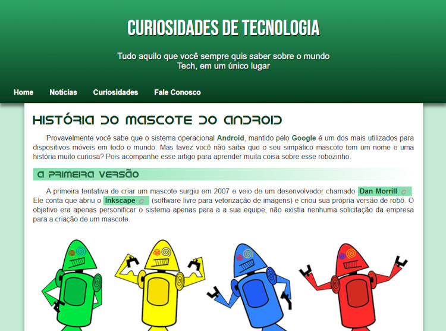

<h1 align="center"> Projeto Android </h1>

   

<h2> 🗒️ Descrição do Projeto </h2>

	O Projeto Android é um site com a temática baseada no sistema operacional <strong>Android</strong> que apresenta brevemente a história do Mascote do Android.

 

	Este foi o primeiro projeto do curso de HTML & CSS, projetado por <a href="https://www.instagram.com/gustavoguanabara/">Gustavo Guanabara</a> e realizado no site do <a href="https://www.cursoemvideo.com/">CursoemVideo</a>.

 

<a href="https://willalmeid.github.io/html-css-curso-em-video/projetos/projeto-android/">Acesse o projeto</a>

<h2> 🤖 Tecnologias </h2>

 Esse projeto utilizou as seguinte tecnoloogias 

 - HTML e CSS 
 - Git e GitHub

<h2> 📃 Licença </h2>

	Esse projeto está sob a licença MIT.

---

Desenvolvido por <a href="https://www.linkedin.com/in/william-almeida-74ab22302/">William Almeida</a>, inspirado pelo <strong>CursoemVideo</strong>.

